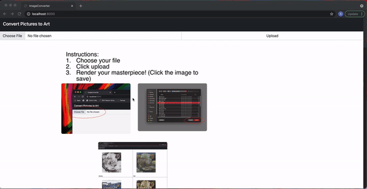

# Style Transferer

Welcome to my CSP Project. This is an image to art converter application that capitalizes heavily on the magenta ML model but I might go back and make my own when I have a GPU. The software runs on flask and allows for a user to choose a file and then combines that image with styles of various artists to create a list of outputted images with transferred styles. 

